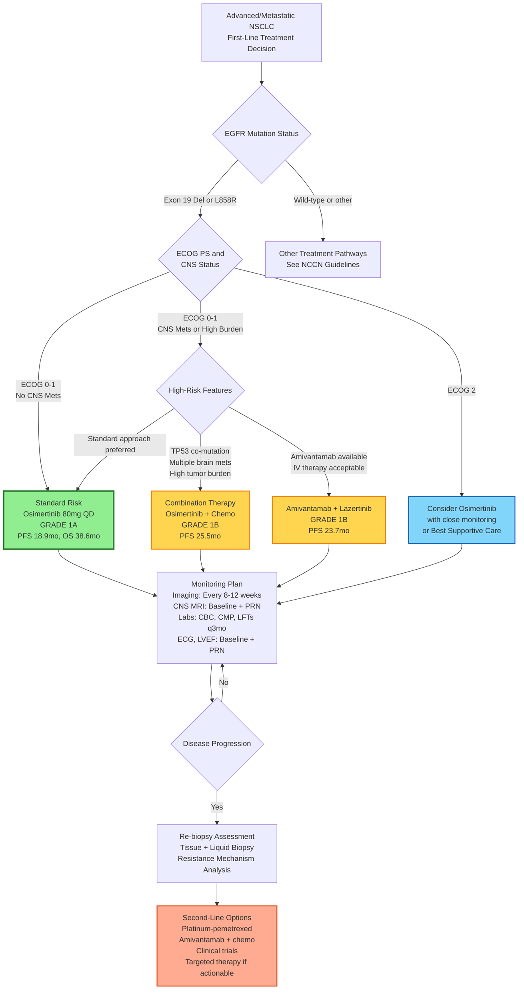

**Clinical Decision Algorithm: EGFR Exon 19 Deletion NSCLC First-Line Treatment**

**Entry Criteria:**
- Diagnosis: Advanced/metastatic NSCLC (Stage IIIB/IV)
- Biomarker: EGFR exon 19 deletion confirmed (NGS or PCR)
- Setting: First-line, no prior systemic therapy
- Patient: ECOG PS 1, no confirmed brain metastases, adequate organ function

**Key Decision Points:**

1. **EGFR Mutation Confirmation** - Mandatory before treatment initiation
   - Exon 19 deletion or L858R → EGFR TKI pathway
   - Exon 20 insertion → Different pathway (amivantamab, mobocertinib)

2. **Performance Status & CNS Assessment**
   - ECOG 0-1 without CNS mets → Standard osimertinib monotherapy (preferred)
   - ECOG 0-1 with CNS mets or high burden → Consider combination therapy
   - ECOG 2 → Osimertinib with caution or best supportive care

3. **High-Risk Feature Evaluation** (for combination consideration)
   - TP53 co-mutation
   - Multiple brain metastases
   - High tumor burden
   - Aggressive disease kinetics

4. **Treatment Selection**
   - **Osimertinib monotherapy** (Grade 1A): Standard of care, best risk-benefit
   - **Osimertinib + chemotherapy** (Grade 1B): Enhanced PFS, higher toxicity
   - **Amivantamab + lazertinib** (Grade 1B): Alternative combination, regulatory status varies

5. **Monitoring & Follow-up**
   - Imaging every 8-12 weeks (RECIST v1.1)
   - CNS MRI at baseline and as indicated
   - Regular lab monitoring and toxicity assessment

6. **Progression Management**
   - Mandatory re-biopsy (tissue + liquid)
   - Identify resistance mechanism (MET amplification, C797S, SCLC transformation)
   - Select second-line therapy based on findings

**Recommendation for This Patient:**
Based on ECOG PS 1, no confirmed brain metastases, and no severe organ dysfunction, **osimertinib 80 mg orally once daily** is the recommended first-line treatment (GRADE 1A, Strong recommendation, High-quality evidence).

---
*Algorithm prepared: 2025-06-15 | Version 1.0 | Evidence-based clinical decision support*
