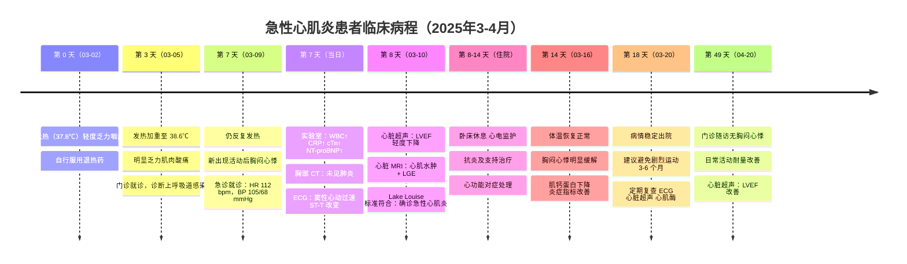

# 图 1：急性心肌炎患者临床病程时间线

## 图注

**图 1：** 患者临床病程时间线。患者以病毒性前驱症状（发热、乏力、咽痛）起病，约 7 天后出现心血管症状（胸闷、心悸）。心脏 MRI 符合 Lake Louise 标准，确诊急性心肌炎。经支持治疗后患者逐渐恢复，随访 1 个月时左室射血分数（LVEF）改善。

*缩写：WBC = 白细胞计数；CRP = C 反应蛋白；cTn = 心肌肌钙蛋白；NT-proBNP = N 末端脑钠肽前体；ECG = 心电图；LVEF = 左室射血分数；LGE = 晚期钆增强；MRI = 磁共振成像*